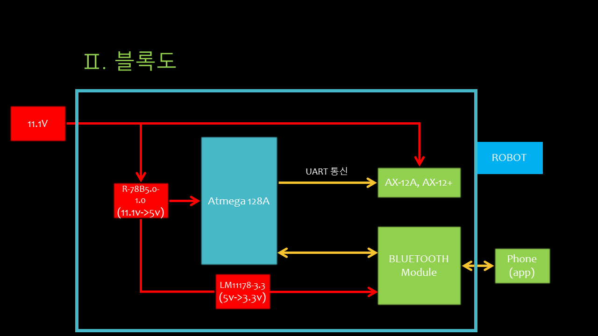
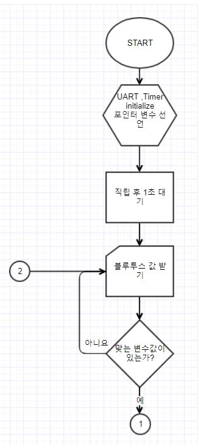
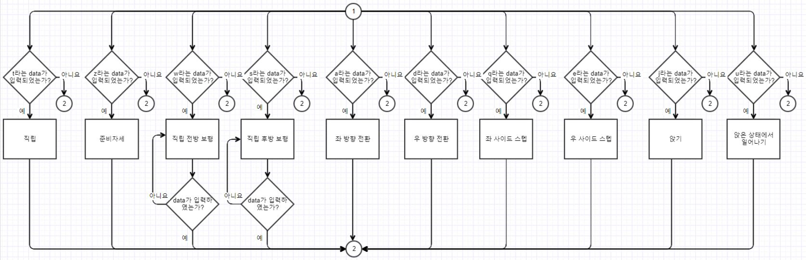
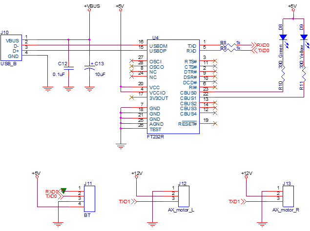
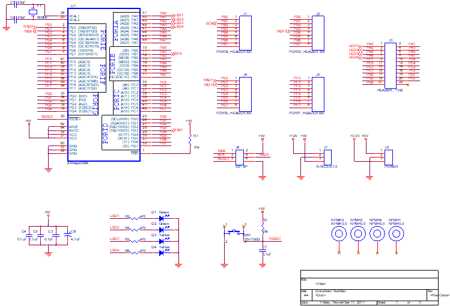
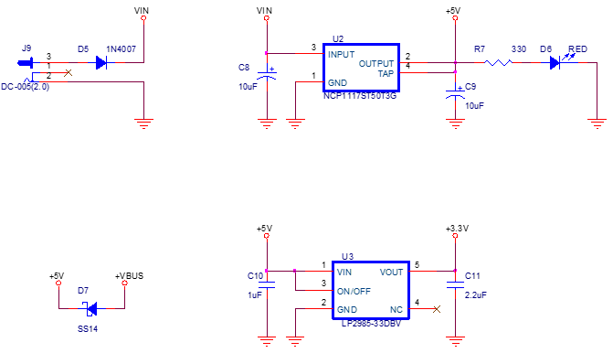

# DynamixelControl
Code to control multiple Dynamixel AX-12 servo motors over USART on an Atmega 128A chip

## 개요
본 시스템은 크게 2가지 단계로 이루어져 있습니다.
1. Bluetooth communication
블루투스 통신을 통해 특정 char 값을 받도록 합니다.  
여기서는 USART0, 비동기 2배속 모드, baud rate 9600BPS로 사용합니다.
2. AX-12A communication
AX-12A를 다중제어 합니다.  
여기서는 USART1, 비동기 2배속 모드, 송신만 사용, baud rate 1M BPS로 사용합니다.

## Block diagram

* ax-12a recommended voltage인 11.1v인가
* R-78C 5.0-1.0을 통해서 atmega128A recommended voltage인 5v로 switching regulation
* LM11178-3.3을 통해서 BCD210 recommended voltage인 3.3v로 linear regulation  
* ax-12a와 UART 송신
* bluetooth module과 UART 송수신

## Flow chart
  
  
1. UART, Timer init과 블루투스로 송신될 char pointer variable 선언
2. 휴머노이드 하체가 직립할 수 있도록 각 ax-12a에 값(angle, speed, flexible val, flexible) 전달
3. 블루투스를 통해서 char 값 받을 때까지 대기
4. char 값이 't', 'z', 'w', 's', 'a', 'd', 'q', 'e', 'j', 'u'라면 각 동작에 맞는 ax-12a에 값 전달
5. 동작하는 중 다른 값이 들어오면 한 동작 후 정지
6. 반복

## Circuit
  
  
  
1. FT232R을 통해서 USB UART통신, VBUS를 통해 전원 공급
2. BT(BCD210)에 5V를 주는 이유는 BCD210 모듈에 LM1117 regulator가 장착 

## Source
```C
UART0_init(9600);
```
매개변수를 통해 bayd rate 설정가능  
조건: f_osc = 16MHz, 비동기 2배속  
<!--
#{BUAD} = \frac{f_{osc}}{{8}({UBRR} + {1})}
#{UBRR} = \frac{f_{osc}}{{8}{BAUD}} - {1}
-->
 
* BAUD  : Baud rate (in bits per second, bps)
* f_osc : System Oscillator clock frequency
* UBRR  : Contents of the UBRRH and UBRRL Registers, (0 - 4095)

| Baud Rate (bps) | UBRR | Error (%) |
| -------- | ----------- |
| 9600 | 207 | 0.2 |
| 115.2k | 16 | 2.1 |
| 250k | 7 | 0.0 |
| 0.5M | 3 | 0.0 |
| 1M | 1 | 0.0 |

## Result
